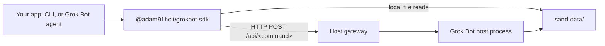

# @adam91holt/grokbot-sdk

TypeScript SDK for a running Grok Bot host. It gives you a typed client over the host's local HTTP gateway, plus readers for the host's on-disk `sand-data` directory.

This package does not invent endpoints. Command names and response shapes come from the host.

Requires **Node 22+**.

```bash
npm i @adam91holt/grokbot-sdk
```

From this repo: `cd sdk && npm ci && npm test && npm run build`. The CLI is `npx grokbot`.

## Two ways in



|  | `GrokBot` — gateway | `GrokBotDisk` — files |
| --- | --- | --- |
| Talks to | The host's HTTP gateway | `sand-data/` on the local filesystem |
| Needs | Reachable host URL + gateway token | Read access to `sand-data` on the **same computer** |
| Host process running? | Yes | No |
| Works remotely? | Yes (tailnet, VPN, LAN, SSH tunnel) | No — same machine only |
| Gives you | Live roster, prompts, interrupts, host status, memories, transcripts, search | Agents, profiles, memories, transcript JSONL, `store.db`, `search-index.db`, automations, workflows |
| Writes | Yes, through the host | Memory facts only, as a fallback |

**Prefer the gateway whenever the host is running.** It is the authoritative live view, and the host owns its own writes — watchers, dreaming metadata, and cross-shard memory merge all happen there. Disk writes bypass all of that.

Reach for `GrokBotDisk` when:

- the host process is not running, or you have no token
- you want to grep or bulk-scan raw files rather than page through an API
- you want something only disk exposes: transcript JSONL, an agent's `store.db`, or `search-index.db`

`sand-data` defaults to `/home/box/sand-data` (alias `/home/box/agent-data`). Override with `SAND_DATA_ROOT`.

## Quick start

```ts
import { GrokBot, GrokBotDisk } from "@adam91holt/grokbot-sdk";

const bot = new GrokBot();
const health = await bot.health();
const agents = await bot.listAgents();

console.log(health.ok, agents.length);

// Same machine, no token needed, no host process needed:
const disk = new GrokBotDisk();
console.log(disk.listAgents().length);
```

`health()` is unauthenticated. Everything else that hits `POST /api/<command>` uses the gateway token (from `gateway.json` or `SAND_GATEWAY_TOKEN`). Never log or commit the token.

## Use it from Grok Bot

A Grok Bot agent on the **same computer** as the host can clone this repo and drive the local gateway:

```bash
git clone https://github.com/adam91holt/grokbot-sdk.git
cd grokbot-sdk/sdk
npm ci
```

Then `new GrokBot()` is enough — no configuration. The SDK reads `sand-data/gateway.json` on this computer for the port and token, and rewrites wildcard binds (`0.0.0.0` / `::`) to `127.0.0.1`.

See [docs/grok-bot.md](docs/grok-bot.md).

## Use it from another machine

The gateway is not on the public internet. From another computer you need a reachable host URL and the token in the environment.

A tailnet (for example [Tailscale](https://tailscale.com)) is the usual way: give the Grok Bot computer a stable name, then:

```bash
export GROKBOT_GATEWAY_URL=http://your-host:1340
export SAND_GATEWAY_TOKEN=...   # from the host's gateway.json — do not git this
```

```ts
const bot = new GrokBot({ gatewayUrl: "http://your-host:1340" });
```

`SAND_GATEWAY_URL` is an alias. Any reachable path works (VPN, SSH tunnel, LAN). The token still comes from `SAND_GATEWAY_TOKEN` or a local `gateway.json`.

Note that `GrokBotDisk` does **not** work across machines — there is no remote disk mode.

See [docs/remote.md](docs/remote.md).

## One-shot helpers

These are SDK loops over real host commands. There is no `waitForCompletion` host API.

| Helper | What it does |
| --- | --- |
| `sendPrompt({ wait: true })` | Accept, then poll until idle and return the last reply |
| `runOnce` | Create a throwaway seat, send, wait, delete |
| `runOnceFrom` | Host-clone a named seat (`duplicateAgent`), send, wait, delete the clone |
| `discussOnce` | Clone several seats into a throwaway room, return every turn, delete |
| `sendAsAgent` | Mint (or reuse) a bus seat and have it call the **SendToAgent** tool. There is no host `sendToAgent` command. |
| `submitJob` | Decide-only job file → clones or a room → packet on disk. Does not implement. |

```ts
const receipt = await bot.sendAsAgent({
  to: "Ada",
  message: "status only",
});
```

`to: "all"` is refused. Default bus seats are throwaways and get deleted.

`createAgent` / `runOnce` always POST a string name and description (minted / `""` when omitted) so the host does not crash on `name.trim()` / `description.trim()`.

## CLI

Same discovery as `new GrokBot()`. `GROKBOT_GATEWAY_URL` wins when set.

```bash
npx grokbot health
npx grokbot agents
npx grokbot send Ada "status only"
npx grokbot run-once "Reply with PONG 1"
npx grokbot send-as --to Ada "status only"
npx grokbot job submit ./job.json
```

`agents` falls back to disk if the gateway call fails. `transcript`, `automations`, and `workflows` read disk directly.

`health` and `discovery` never print the token (`hasToken` is a boolean). See [docs/cli.md](docs/cli.md) and [sdk/README.md](sdk/README.md).

## Security

- Never commit `gateway.json`, `.env`, or tokens.
- Transcripts and `store.db` are sensitive. The CLI prints metadata unless you pass `--raw`.
- Destructive host commands are not first-class methods. They need `allowUnsafeCommands` or `commandUnsafe()`.
- `store.db` and `search-index.db` are opened read-only. The SDK never writes them.

## Docs

- [Use from Grok Bot](docs/grok-bot.md)
- [Remote / tailnet](docs/remote.md)
- [CLI](docs/cli.md)
- [API reference](sdk/README.md)
- [Releasing / npm publish](docs/releasing.md)

## Repo

This repository is the SDK only (`sdk/`). It does not ship the Grok Bot host, desktop, or an ops dashboard.

Live `sand-data` is not in git: tokens, secrets, chats, transcripts, `store.db`.

## License

[MIT](LICENSE)
